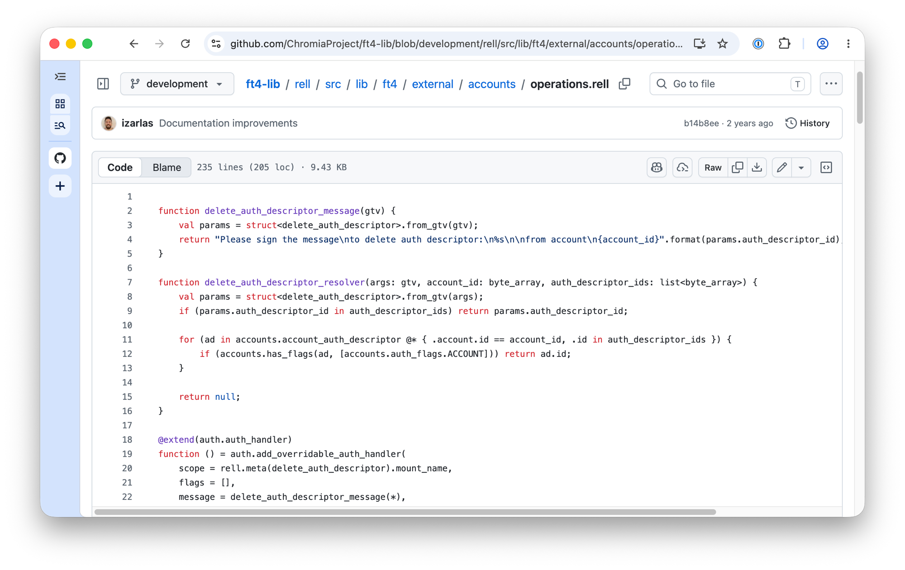

# Rell Syntax Highlighting

A Chrome extension (Manifest V3, Bun + TypeScript) that adds [Rell](https://docs.chromia.com/rell) syntax highlighting on github.com, gitlab.com, and bitbucket.org, where the language is not natively supported.

**[➜ Install from the Chrome Web Store](https://chromewebstore.google.com/detail/pffphipdgoiknoegflinddleeiffiali)**



It highlights:

- `.rell` files in blob/blame views on GitHub (virtualized react code view) and GitLab (chunked source viewer, raw file fetched once per page),
- `.rell` diffs in GitHub's react diff viewer (pull request "Files changed", commit and compare pages), GitLab MR/commit diffs, and Bitbucket PR diffs — each file's visible lines are tokenized as one text so block comments keep state across lines,
- `.rell` files on Bitbucket Cloud by registering Rell as a Monaco editor language (Monarch tokenizer) from a MAIN-world script — Monaco then colors tokens with its own theme,
- fenced ` ```rell ` code blocks in READMEs, issues, MRs/PRs, and comments (`pre[lang="rell"]`, `code.language-rell`, GitLab's `pre[data-canonical-lang="rell"]`).

Tokens are wrapped in each site's native syntax classes — GitHub `pl-*`, GitLab `hljs-*` (styled under `.code.highlight` in every GitLab theme) — so colors automatically match the user's site theme in both light and dark mode. Bitbucket markdown blocks use the extension's own small injected CSS.

Self-hosted GitLab/Bitbucket instances are not matched by default; add your host to `content_scripts.matches` in `static/manifest.json` if you need one.

The tokenizer (`src/rell.ts`) is hand-derived from the ANTLR grammar at `rell3/rell-base/frontend/src/main/antlr/Rell.g4`: keywords, `true`/`false`/`null`, integers, hex, big integers (`L`), decimals, strings, bytes literals (`x"…"`/`x'…'`), line and multi-line comments, `@annotations`, and definition names.

## Install

The released extension is on the Chrome Web Store: **[Rell Syntax Highlighting](https://chromewebstore.google.com/detail/pffphipdgoiknoegflinddleeiffiali)**.

To run the latest `master` instead, download the CI artifact [rell-github-highlighting.zip](https://gitlab.com/chromaway/rell-chrome-extension/-/jobs/artifacts/master/download?job=build), extract it, and load the folder as described in [Load unpacked](#load-unpacked).

## Build

```sh
bun install
bun run build    # bundles to extension-unpacked/ (gitignored)
```

## Load unpacked

1. Open `chrome://extensions`.
2. Enable **Developer mode**.
3. Click **Load unpacked** and select the `extension-unpacked/` directory.

## Develop

```sh
bun test             # tokenizer tests
bun run typecheck    # tsc --noEmit
```

After code changes, re-run `bun run build` and hit the reload icon on the extension card in `chrome://extensions`.
